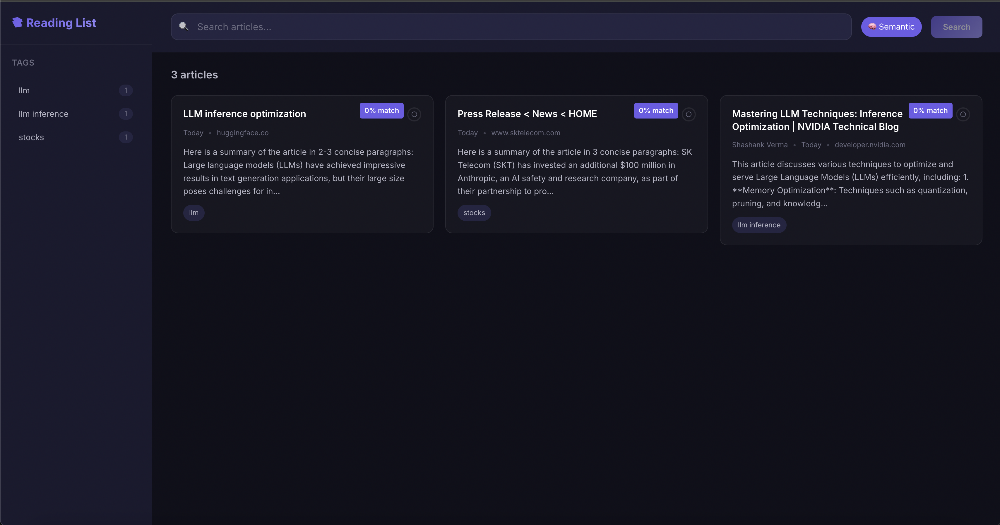
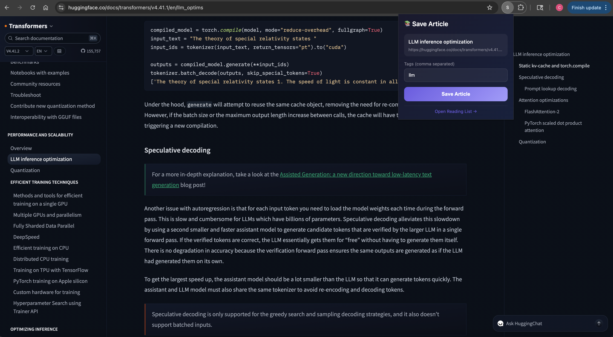
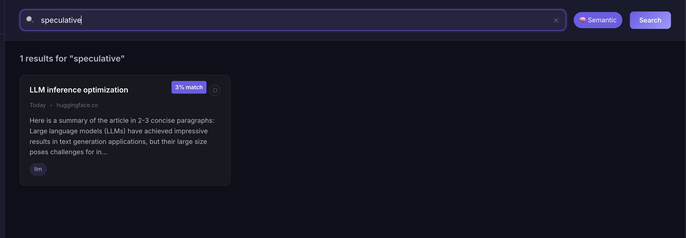

# 📚 Smart Reading List

<p align="center">
  <strong>AI-powered personal knowledge base for web articles</strong>
</p>

<p align="center">
  
  
  
  
  
</p>

<p align="center">
  <a href="#-features">Features</a> •
  <a href="#-demo">Demo</a> •
  <a href="#-architecture">Architecture</a> •
  <a href="#-quick-start">Quick Start</a> •
  <a href="#-docker">Docker</a>
</p>

---

## ✨ Features

- **🔖 One-Click Save** — Chrome extension to save any article instantly
- **🤖 AI Summaries** — Automatic summarization using local LLMs (Ollama)
- **🔍 Semantic Search** — Find related content even without exact keywords (RAG)
- **🏷️ Smart Tagging** — Organize with tags and filter your library
- **🔒 Privacy-First** — Everything runs locally, your data never leaves your machine

## 🎬 Demo

<!-- Add your demo GIF/video here -->




## 🏗️ Architecture

```
┌─────────────────┐     ┌─────────────────┐     ┌─────────────────┐
│ Chrome Extension│────▶│  FastAPI Backend │────▶│   Ollama LLM    │
│   (Save Page)   │     │   (port 8000)    │     │ (Summarization) │
└─────────────────┘     └────────┬─────────┘     └─────────────────┘
                                 │
                    ┌────────────┼────────────┐
                    ▼            ▼            ▼
              ┌─────────┐  ┌──────────┐  ┌─────────┐
              │ SQLite  │  │ ChromaDB │  │  React  │
              │ (FTS5)  │  │ (Vectors)│  │   UI    │
              └─────────┘  └──────────┘  └─────────┘
```

### Tech Stack

| Component | Technology |
|-----------|------------|
| **Backend** | FastAPI, Python 3.12, SQLite (FTS5) |
| **AI/ML** | Ollama (local LLM), ChromaDB (vector search) |
| **Frontend** | React 18, TypeScript, Vite |
| **Extension** | Chrome Manifest V3 |
| **Parsing** | Trafilatura, Readability |

## 🚀 Quick Start

### Prerequisites

- Python 3.12+
- Node.js 18+
- [Ollama](https://ollama.ai) installed

### 1. Clone & Setup

```bash
git clone https://github.com/chinmay29/smart-reading-list.git
cd smart-reading-list
```

### 2. Start Ollama

```bash
# Install Ollama (if not already)
brew install ollama

# Start Ollama server
ollama serve

# Pull the model (in another terminal)
ollama pull llama3.2:3b
```

### 3. Start Backend

```bash
cd backend
python3.12 -m venv venv
source venv/bin/activate
pip install -r requirements.txt
uvicorn app.main:app --reload --port 8000
```

### 4. Start Frontend

```bash
cd frontend
npm install
npm run dev
```

### 5. Load Chrome Extension

1. Open `chrome://extensions`
2. Enable **Developer mode**
3. Click **Load unpacked**
4. Select the `extension/` folder

### 6. Start Using!

1. Navigate to any article
2. Click the extension icon
3. Add tags (optional) and click **Save**
4. View summaries at `http://localhost:5173`

## 🐳 Docker

Run everything with Docker Compose:

```bash
docker-compose up -d
```

Then load the Chrome extension and start saving articles!

| Service | URL |
|---------|-----|
| Frontend | http://localhost:5173 |
| Backend API | http://localhost:8000 |
| API Docs | http://localhost:8000/docs |

## 📁 Project Structure

```
smart-reading-list/
├── backend/                 # FastAPI Python backend
│   ├── app/
│   │   ├── api/            # REST endpoints
│   │   ├── models/         # Pydantic schemas
│   │   ├── parsers/        # HTML parsing (extensible)
│   │   └── services/       # LLM, storage, vector
│   └── requirements.txt
├── frontend/               # React + Vite + TypeScript
│   └── src/
│       ├── components/     # UI components
│       ├── hooks/          # Data fetching hooks
│       └── services/       # API client
├── extension/              # Chrome Extension (MV3)
│   ├── popup/              # Extension popup UI
│   ├── background/         # Service worker
│   └── manifest.json
└── docker-compose.yml
```

## 🔮 Roadmap

- [ ] PDF & DOCX support
- [ ] Q&A over your reading history (RAG chat)
- [ ] Knowledge graph visualization
- [ ] Mobile app (PWA)
- [ ] Notion/Obsidian export

## 🤝 Contributing

Contributions welcome! Feel free to submit issues and PRs.

## 📄 License

MIT License - feel free to use this for your own projects!

---

<p align="center">
  Built with ❤️ by <a href="https://github.com/chinmay29">Chinmay</a>
</p>
